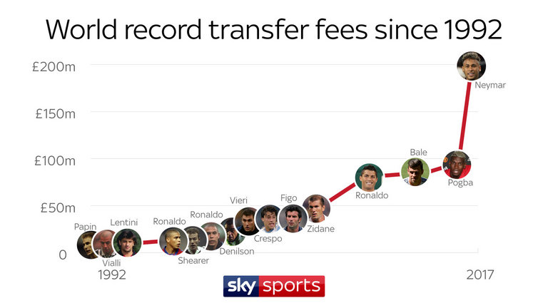

# Machine Learning Engineer Nanodegree

## Capstone Proposal
Sahil Goyal
October 18th, 2017

## Domain Background

Football (or *soccer*) is the biggest global sport and is a fast-growing multibillion dollar industry; with an estimate of 27 billion dollars in terms of annual revenue for the football clubs [1]. With more and more money pouring into the sport, the betting industry for predicting the outcome of matches is worth a billions pounds every year [2].

Prediction of soccer matches is a tough problem. Predicting the exact scoreline is a near impossible task. The game involves emotional factors such as the passion of the crowd, how pumped the players are that day, players' personal lives; factors which are beyond measure. In this project, I wish to tackle the problem using factors we can indeed measure.

### Personal Motivation
I would divide by motivation to do this project into two reasons

* ***My Interest and domain knowledge*** in this field. I follow European soccer 

## References
[1] [Call for Papers for a Special Issue in the Springer Journal] (http://static.springer.com/sgw/documents/1599268/application/pdf/MachineLearning-CallForPapers-MachineLearningForFootball-v15+%282%29.pdf)
[2] [Football betting - the global gambling industry worth billions] (http://www.bbc.com/sport/football/24354124)